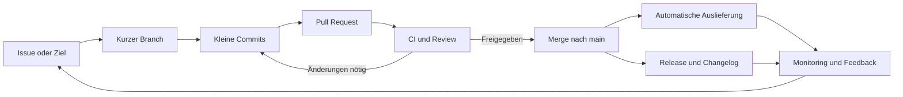

# Agiler Git-Workflow

Diese Richtlinie definiert einen modernen, allgemein einsetzbaren Git-Workflow für Softwareprojekte. Sie verbindet kurze agile Lieferzyklen mit einer geschützten Hauptlinie, nachvollziehbaren Änderungen und automatisierter Qualitätssicherung.

Die Begriffe **MUSS**, **SOLL** und **KANN** kennzeichnen verbindliche Regeln, Empfehlungen und optionale Praktiken.

## Grundsätze

- Der Standard-Branch (`main`) MUSS jederzeit integrierbar und auslieferbar sein.
- Änderungen MÜSSEN klein, unabhängig, überprüfbar und bei Bedarf rücksetzbar sein.
- Arbeit MUSS durch ein nachvollziehbares Issue, Ticket oder einen dokumentierten Änderungsgrund motiviert sein.
- Feedback SOLL früh erfolgen: durch kurze Branches, kleine Pull Requests und kontinuierliche Integration.
- Unfertige Funktionen SOLLEN hinter Feature Flags liegen, statt über langlebige Branches isoliert zu werden.
- Git-Historie, CI-Ergebnisse und Pull Requests bilden die überprüfbare Entscheidungs- und Änderungsspur.

## Arbeitsfluss



### 1. Arbeit vorbereiten

Ein Arbeitselement ist bereit, wenn Ziel, Nutzen und überprüfbare Akzeptanzkriterien klar sind. Risiken, Abhängigkeiten und erforderliche Migrationen SOLLEN vor Beginn sichtbar gemacht werden.

Große Vorhaben MÜSSEN in vertikale, einzeln wertvolle Änderungen zerlegt werden. Ein Pull Request SOLL innerhalb eines Arbeitstags sinnvoll reviewbar sein.

### 2. Branch erstellen

Vor Arbeitsbeginn MUSS der lokale Standard-Branch aktualisiert werden. Für jede Änderung wird ein kurzlebiger Branch erstellt:

```sh
git switch main
git pull --ff-only
git switch -c <typ>/<kurze-beschreibung>
```

Empfohlene Präfixe:

| Präfix | Zweck |
| --- | --- |
| `feat/` | Neue oder erweiterte Funktion |
| `fix/` | Fehlerbehebung |
| `docs/` | Dokumentation |
| `refactor/` | Strukturänderung ohne beabsichtigte Verhaltensänderung |
| `test/` | Tests |
| `chore/` | Wartung, Werkzeuge oder Abhängigkeiten |
| `hotfix/` | Dringende Korrektur einer produktiven Version |

Branch-Namen MÜSSEN kurz, kleingeschrieben und mit Bindestrichen getrennt sein, zum Beispiel `feat/export-filter`.

Branches SOLLEN höchstens wenige Tage bestehen. Änderungen aus `main` werden regelmäßig per Rebase übernommen:

```sh
git fetch origin
git rebase origin/main
```

Gemeinsam genutzte Branches DÜRFEN nicht ohne Abstimmung umgeschrieben werden.

### 3. Committen

Jeder Commit MUSS einen zusammengehörigen, funktionsfähigen Schritt darstellen. Er SOLL Tests und Dokumentation enthalten, die unmittelbar zu seiner Änderung gehören. Zugangsdaten, personenbezogene Daten, generierte Artefakte und lokale Konfigurationen DÜRFEN nicht committed werden.

Commit-Nachrichten SOLLEN dem Format von Conventional Commits folgen:

```text
<typ>(<optionaler-bereich>): <kurze handlungsorientierte zusammenfassung>

<optionale begründung und auswirkungen>

<optionale referenzen oder BREAKING CHANGE>
```

Beispiele:

```text
feat(search): add result filtering
fix(auth): reject expired sessions
docs: clarify release process
```

Vor jedem Push MÜSSEN die für die Änderung relevanten Formatierungs-, Prüf- und Testläufe lokal erfolgreich sein.

### 4. Pull Request öffnen

Ein Pull Request MUSS enthalten:

- Problem und Ziel der Änderung,
- Lösungsansatz und wesentliche Entscheidungen,
- Nachweis der Tests,
- Risiken, Migrationen und Rücksetzplan, sofern relevant,
- Referenz auf das zugehörige Arbeitselement,
- Screenshots oder andere Nachweise bei sichtbaren Änderungen.

Ein Draft Pull Request KANN früh für Feedback geöffnet werden. Er darf erst als reviewbereit markiert werden, wenn die Akzeptanzkriterien erfüllt, Selbstreview und Tests abgeschlossen sowie Konflikte behoben sind.

### 5. CI und Review

Die CI MUSS mindestens Formatierung beziehungsweise statische Analyse, Tests, Build und Sicherheitsprüfungen abdecken, soweit diese für das Repository anwendbar sind. Alle verpflichtenden Prüfungen MÜSSEN erfolgreich sein.

Mindestens eine berechtigte, nicht selbst verfassende Person MUSS den Pull Request freigeben. Für sicherheitskritische oder weitreichende Änderungen SOLLEN Code Owner oder weitere Fachverantwortliche einbezogen werden.

Reviews bewerten insbesondere:

- Korrektheit und Erfüllung der Akzeptanzkriterien,
- Verständlichkeit und angemessene Komplexität,
- Testabdeckung und Fehlerfälle,
- Sicherheit, Datenschutz und Abwärtskompatibilität,
- Dokumentation, Betrieb und Rücksetzbarkeit.

Sachliche Review-Kommentare MÜSSEN beantwortet oder umgesetzt werden. Nach wesentlichen Änderungen MUSS eine erneute Freigabe erforderlich sein.

### 6. Zusammenführen

Direkte Pushes auf `main` sind verboten. Pull Requests werden standardmäßig per **Squash Merge** zusammengeführt, damit jede gelieferte Änderung einen klaren Historieneintrag besitzt. Die Squash-Nachricht MUSS das Commit-Format erfüllen und das Arbeitselement referenzieren.

Merge Commits KÖNNEN für bewusst erhaltene Teilhistorien verwendet werden. Rebase Merge KANN genutzt werden, wenn alle einzelnen Commits bereits sauber, unabhängig und geprüft sind. Die Strategie MUSS innerhalb eines Repositorys einheitlich sein.

Nach dem Merge MUSS der Quell-Branch gelöscht werden. Fehler auf `main` werden durch einen neuen Korrektur-Pull-Request oder durch Revert des Merge-Commits behoben; veröffentlichte Historie wird nicht umgeschrieben.

### 7. Ausliefern und lernen

Jeder Merge nach `main` SOLL automatisch in eine überprüfbare Umgebung ausgeliefert werden. Produktive Auslieferungen SOLLEN klein, automatisiert und mit klarer Rücksetz- oder Roll-forward-Strategie erfolgen.

Versionen MÜSSEN unveränderlich markiert werden, vorzugsweise mit signierten Git-Tags und Semantic Versioning:

```text
v<major>.<minor>.<patch>
```

Release Notes oder ein Changelog MÜSSEN nutzerrelevante Änderungen, Migrationen und bekannte Einschränkungen nennen. Telemetrie, Fehlerberichte und Nutzerfeedback fließen als neue Arbeitselemente in den nächsten Zyklus zurück.

## Dringende Korrekturen

Hotfixes folgen demselben Qualitätsweg wie andere Änderungen, werden aber priorisiert und auf den kleinsten sicheren Umfang begrenzt. Sie starten vom aktuellen produktiven Stand, benötigen verpflichtende CI und Review und werden nach erfolgreicher Prüfung unmittelbar ausgeliefert.

Ausgelassene, nicht kritische Prüfungen MÜSSEN dokumentiert und unmittelbar nach der Stabilisierung nachgeholt werden. Der Hotfix MUSS in `main` enthalten sein; parallele, voneinander abweichende Korrekturen sind zu vermeiden.

## Definition of Done

Eine Änderung ist erst abgeschlossen, wenn:

- [ ] die Akzeptanzkriterien erfüllt sind,
- [ ] Code, Tests und Dokumentation gemeinsam aktualisiert wurden,
- [ ] alle verpflichtenden CI-Prüfungen erfolgreich sind,
- [ ] das Review abgeschlossen und alle relevanten Hinweise geklärt sind,
- [ ] Sicherheits-, Datenschutz- und Migrationsfolgen bewertet wurden,
- [ ] die Änderung in `main` integriert und der Branch gelöscht wurde,
- [ ] Auslieferung und Monitoring erfolgt oder bewusst terminiert sind,
- [ ] das Arbeitselement geschlossen und die Änderung nachvollziehbar dokumentiert ist.

## Erforderliche Repository-Regeln

Damit diese Richtlinie nicht nur eine Empfehlung bleibt, MUSS die Hosting-Plattform für `main` mindestens folgende Regeln technisch erzwingen:

- Pull Requests als einzigen Schreibweg,
- mindestens eine Freigabe und Code-Owner-Freigaben, falls definiert,
- erfolgreiche Pflichtprüfungen vor dem Merge,
- erneute Freigabe nach wesentlichen Änderungen,
- gelöste Review-Diskussionen,
- aktuellen Stand gegenüber `main`,
- Verbot von Force Pushes und Branch-Löschung,
- eingeschränkte Umgehungsrechte mit nachvollziehbarem Audit-Log,
- automatische Löschung zusammengeführter Quell-Branches.

Zusätzlich SOLLEN Secret Scanning, Dependency Updates, Commit- oder Tag-Signaturen und eine Merge Queue aktiviert werden, sofern die Plattform sie unterstützt.

## Kontinuierliche Verbesserung

Das Team überprüft regelmäßig Durchlaufzeit, Review-Wartezeit, Fehlerrate nach Änderungen und Wiederherstellungszeit. Retrospektiven führen zu konkreten, verantworteten Anpassungen dieser Richtlinie oder der Automatisierung. Prozessregeln, die keinen erkennbaren Qualitäts- oder Liefernutzen mehr bringen, SOLLEN vereinfacht oder entfernt werden.

Änderungen an diesem Workflow erfolgen selbst über einen Pull Request und werden wie jede andere Änderung geprüft.
