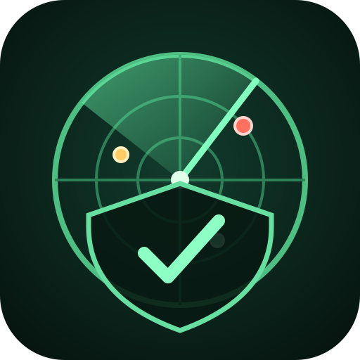
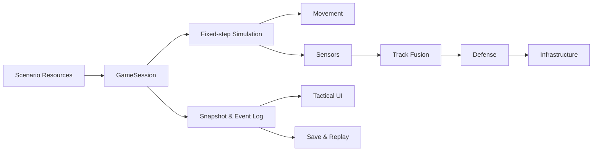

<div align="center">



# 📡 Radar Operator

**Taktische Luftlage-Simulation im Radarkontrollraum**

[](https://godotengine.org/)
[](https://github.com/maschin96/radar-operator/actions/workflows/ci.yml)


[](LICENSE)

*Sensoren aufstellen. Unsichere Tracks bewerten. Kritische Infrastruktur schützen.*

</div>

## Über das Spiel

Radar Operator ist ein taktisches Strategie- und Simulationsspiel für Godot 4. Du leitest den Radarkontrollraum eines fiktiven Landes, baust ein Sensornetz auf und koordinierst abstrahierte Abwehrsysteme. Das Lagebild zeigt keine perfekte Wahrheit: Messfehler, Klassifikationskonfidenz und wachsende Track-Unsicherheit sind zentrale Spielmechaniken.

Alle Staaten, Systeme, Signaturen und Leistungswerte sind fiktiv. Das Projekt bildet keine realen Waffensysteme oder Einsatzverfahren detailgetreu nach.

## Aktueller Umfang

- geführte **Tutorial Mission 1 – Erste Wachschicht** mit zehn Lernschritten
- Hauptmenü, datengetriebene Missionsauswahl und lokaler Kampagnenfortschritt
- persistente Darstellungs-, Audio-, Eingabe- und Barrierefreiheitseinstellungen
- freie Platzierung von Radar- und Abwehrsystemen innerhalb eines Budgets
- feste, deterministische Simulation mit Pause sowie 1×-, 2×- und 4×-Tempo
- Sensorerfassung, Messfehler, Track-Fusion und Klassifikationskonfidenz
- automatische Zielpriorisierung, Munitions- und Abwehrzustände
- manuelle Trackpriorität sowie protokollierte Freigabe, Sperre und Rücknahme
- kritische Infrastruktur, Energieabhängigkeiten und Missionsziele
- Ereignisprotokoll, Missionsauswertung und Replay-Daten
- deterministisches Speichern und Laden
- Kontrastmodus, reduzierte Effekte und deaktivierbare Warntöne
- Export-Presets für macOS, Windows und Linux

## Schnellstart

### Voraussetzungen

- [Godot 4.7.2](https://godotengine.org/download/archive/4.7.2-stable/) oder neuer innerhalb der 4.x-Reihe
- Git

### Repository starten

```sh
git clone https://github.com/maschin96/radar-operator.git
cd radar-operator
godot --editor project.godot
```

Im Godot-Editor anschließend `F6` beziehungsweise `F5` drücken. Direktstart ohne Editor:

```sh
godot --path .
```

Falls Godot als `godot4` installiert ist, `godot` in den Befehlen entsprechend ersetzen.

## Tutorial Mission 1

Die Einstiegsmission führt durch den vollständigen Kernablauf:

1. Einsatzauftrag lesen.
2. Frühwarnsensor auswählen und platzieren.
3. Kurzstreckenabwehr für das Kraftwerk aufstellen.
4. Mission starten und den ersten Kontakt erfassen.
5. Den automatisch pausierten Track untersuchen.
6. Simulation fortsetzen und die Missionsauswertung erreichen.

Grün umrandete Flächen sind zulässige Bauzonen, rote Flächen sind gesperrt. Tutorial-Hinweise lassen sich ausblenden, ohne die Mission abzubrechen.

## Steuerung

| Eingabe | Funktion |
| --- | --- |
| Linke Maustaste | System platzieren oder Objekt auswählen |
| Mittlere Maustaste | Karte verschieben |
| Mausrad | Karte zoomen |
| Pfeiltasten | Fokussierte Karte verschieben |
| Leertaste | Pause beziehungsweise mit 1× fortsetzen |
| `1`, `2`, `4` | Simulationsgeschwindigkeit |
| `B` | Briefing ein- oder ausblenden |

## Tracksteuerung

Einen Track auf der Karte auswählen, dann in den Lagedetails priorisieren, freigeben, sperren oder auf die Standardregeln zurücksetzen. Manuelle Freigaben gelten nur bei ausreichender Klassifikation und mindestens einem verfügbaren System in Reichweite. Die Details nennen konkrete Hindernisse. Eine Sperre bricht laufende Einsätze beim nächsten Simulationstick ab; bei Pause wird keine Munition verbraucht. „Freigabe zurücknehmen“ stellt die aktiven Regeln wieder her: Bei automatischer Freigabe darf das System daher erneut zuweisen.

## Architektur

Die Darstellung liest ausschließlich Snapshots der Simulation. Spieleraktionen werden über die `GameSession` an klar getrennte Systeme weitergegeben.



Balancing und Szenarien liegen als textbasierte Godot Resources unter `data/`. Dadurch bleiben Änderungen reviewbar und benötigen keine fest eincodierten Werte in der UI.

## Tests

Die vollständige Suite importiert das Projekt headless und führt 67 deterministische Unit-, Integrations- und End-to-End-Testfälle aus:

```sh
./scripts/run_smoke_test.sh
```

Ein abweichender Godot-Pfad kann explizit gesetzt werden:

```sh
GODOT_BIN=/pfad/zu/godot ./scripts/run_smoke_test.sh
```

Die gleiche Suite läuft bei Pushes und Pull Requests über GitHub Actions.

## Desktop-Exports

Nach Installation der Godot-4.7.2-Export-Templates:

```sh
godot --headless --path . --export-debug "macOS" builds/macos/RadarOperator.zip
godot --headless --path . --export-debug "Windows" builds/windows/RadarOperator.exe
godot --headless --path . --export-debug "Linux" builds/linux/RadarOperator.x86_64
```

Die Presets erzeugen unsignierte Debug-Builds. Signierung, Notarisierung, Installer und Store-Pakete sind noch nicht Bestandteil des Prototyps.

## Projektstruktur

```text
data/                Szenarien und Definitionen für Sensoren, Abwehr und Infrastruktur
docs/                Spielkonzept, technische Architektur und QA-Stand
scenes/              Godot-Szenen für Anwendung und taktische Karte
scripts/app/         Composition Root und laufende Spielsitzung
scripts/core/        Datenmodelle, Ressourcen und Szenario-Validierung
scripts/simulation/  Deterministische Zustandsobjekte und Simulationsuhr
scripts/systems/     Bewegungs-, Sensor-, Track-, Abwehr- und Persistenzsysteme
scripts/ui/          Taktische Karte, Audio und Tutorialführung
scripts/tests/       Headless Unit-, Integrations- und End-to-End-Tests
```

## Dokumentation

- [Spiel- und Technikkonzept](docs/radar-operator-konzept.md)
- [QA, Plattformstatus und bekannte Einschränkungen](docs/qa-und-bekannte-einschraenkungen.md)
- [UI-Designsystem](docs/ui-designsystem.md)
- [Produktvision v0.5 Public Demo](docs/produktvision-v0.5.md)
- [Änderungsverlauf](CHANGELOG.md)
- [Hinweise für Beiträge](CONTRIBUTING.md)
- [Agiler Git-Workflow](AGILE_GIT_WORKFLOW.md)

## Roadmap zur v0.5 Public Demo

- **v0.2 Produktgrundlage:** Missionsauswahl, Fortschritt, Einstellungen und Designsystem
- **v0.3 Entscheidungstiefe:** manuelle Freigabe, Einsatzregeln, Netze, Gelände und Störung
- **v0.4 Mini-Kampagne:** vier Missionen sowie animierte Auswertung
- **v0.5 Public Demo:** Produktionspass, Playtests, Plattform-QA und Veröffentlichung

Die vollständige Zieldefinition und der priorisierte Backlog stehen in der [Produktvision v0.5](docs/produktvision-v0.5.md).

## Beiträge und Lizenz

Fehlerberichte und Pull Requests sind willkommen; Details stehen in [CONTRIBUTING.md](CONTRIBUTING.md). Radar Operator wird unter der [GNU General Public License v3.0 or later](LICENSE) veröffentlicht.
