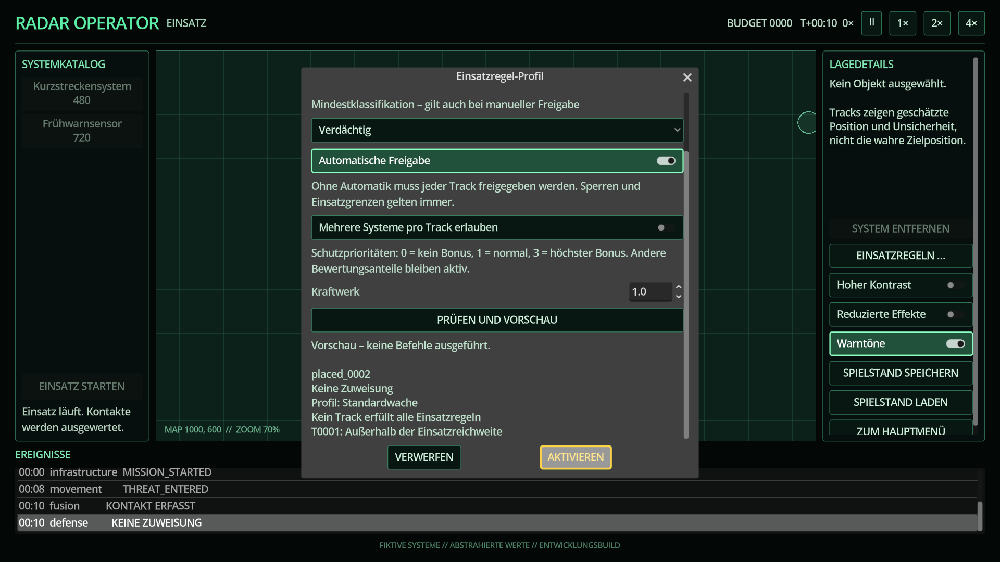

# Einsatzregeln und Entscheidungserklärungen

Jede Mission startet mit einem benannten Regelprofil. Der Editor öffnet über **Einsatzregeln …** und pausiert die Simulation während der Bearbeitung.

1. Eine Vorlage wählen oder einen eigenen Profilnamen eingeben.
2. Mindestklassifikation, automatische Freigabe, redundante Einsätze und Schutzprioritäten konfigurieren.
3. **Prüfen und Vorschau** wählen. Konflikte werden erklärt; die Vorschau verändert weder Simulation noch Ereignisse oder Zufallszustand.
4. **Aktivieren** protokolliert genau einen Spielerbefehl und übernimmt das vollständige Profil. **Verwerfen** stellt das vorherige Simulationstempo wieder her, ohne Regeln zu ändern.

Automatische Freigabe für unbekannte Kontakte wird als unsichere Kombination abgelehnt. Manuelle Freigaben umgehen Mindestklassifikation, Reichweite, Systemzustand oder Munition nicht. Redundante Einsätze sind standardmäßig strikt deaktiviert.

## Entscheidungsbewertung

Die Systemdetails nennen das aktive Profil, alle geprüften Tracks und Ablehnungsgründe. Für zulässige Tracks wird die Bewertung als Summe aus Klassifikation, Schutzdringlichkeit, Erfolgsaussicht und manueller Priorität abzüglich Doppelbelegung angezeigt. Gleichstände werden stabil über die Track-ID entschieden.

Nicht-Zuweisungen und Abbrüche erzeugen strukturierte Ereignisse. Identische Nicht-Zuweisungen werden nicht in jedem Tick wiederholt. Änderungen an den Regeln wirken ausschließlich über `GameSession.set_defense_rules()` und bleiben über Replay sowie Save/Load reproduzierbar.

