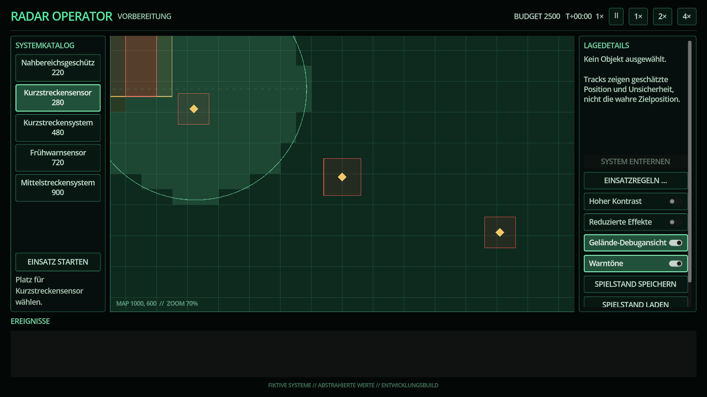

# Gelände, Höhe und Sichtbarkeit

Radar Operator berechnet Sensorabdeckung aus einem abstrakten, deterministischen Geländeraster. Das Modell ist bewusst spielerisch und bildet keine realen Radarverfahren ab.

## Regeln

- Das Raster verwendet standardmäßig Zellen von 50 × 50 Karteneinheiten.
- Höhenzonen setzen eine abstrahierte Geländehöhe und optional einen Sichtfaktor zwischen 0 und 1.
- Sichtblocker können denselben Pfad zusätzlich begrenzen.
- Eine ganzzahlige Linienabtastung prüft jede Rasterzelle zwischen Sensor und Ziel. Der niedrigste Sichtfaktor sowie Gelände oberhalb der abstrahierten Sichtlinie bestimmen das Ergebnis.
- Das Resultat wird auf Tausendstel quantisiert. Identische Kartendaten erzeugen deshalb unabhängig von Fließkommadetails dieselbe Maske.
- Schlechtere Sicht reduziert die Erfassungswahrscheinlichkeit und Klassifikationsstärke und erhöht den Positionsfehler bis auf das 2,5-Fache.

Die nominelle Sensorreichweite bleibt in der Bauvorschau als Außenlinie sichtbar. Farbige Rasterflächen zeigen den tatsächlich sichtbaren Anteil schon vor dem Kauf: Grün steht für gute, Gelb für eingeschränkte und Rot für stark eingeschränkte Sicht.



## Cache und Debugansicht

Masken werden pro quantisierter Sensorzelle, Reichweite und Sensorhöhe nur einmal erzeugt. Platzierungsvorschau, laufende Sensorlogik und spätere Abfragen verwenden denselben Cache. Die schaltbare **Gelände-Debugansicht** zeigt Höhenzonen und Blocker; ihr Tooltip meldet Maskenzahl, Cachetreffer und Laufzeit der letzten Erzeugung.

## Szenariodaten

`ScenarioDefinition.terrain_model_version` versioniert das Schema. `terrain_cell_size`, `terrain_default_height`, `terrain_zones` und `visibility_blockers` beschreiben die Karte:

```gdscript
{
    "area": Rect2(300, 0, 100, 350),
    "terrain_type": &"ridge", # nur bei terrain_zones erforderlich
    "height": 180.0,
    "visibility_factor": 0.25,
}
```

Der Szenariolader lehnt negative Höhen, Faktoren außerhalb von 0 bis 1, leere Flächen und Flächen außerhalb der Karte ab. Sensorressourcen können ihre abstrahierte Aufbauhöhe über `sensor_height` festlegen.
