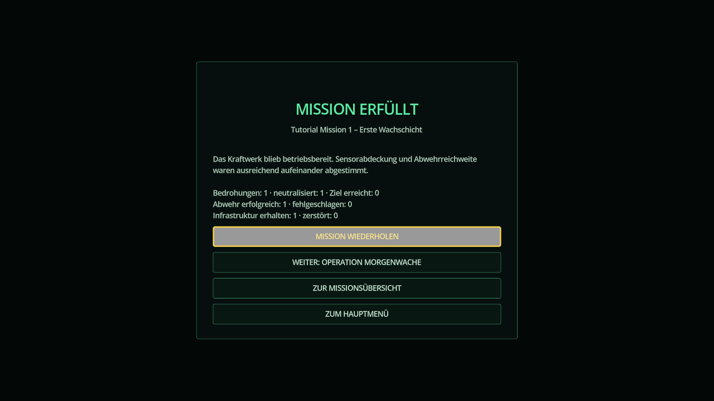

# Kampagnenfluss und Missionsrahmen

## Ablauf

Die Anwendung führt in einer festen, tastaturbedienbaren Reihenfolge durch Hauptmenü, Missionsübersicht, Briefing, Einsatz und Debriefing. Nach einer Auswertung kann dieselbe Mission wiederholt, die nächste freigeschaltete Mission gestartet oder zur Übersicht beziehungsweise zum Hauptmenü gewechselt werden.

Die Missionsübersicht unterscheidet gesperrte, verfügbare und abgeschlossene Missionen. Sie zeigt den Kampagnenfortschritt, die erwartete Dauer, Lernziele und das beste bisherige Ergebnis. Ein Sieg wird sofort im lokalen Profil gespeichert und schaltet alle Missionen frei, deren Voraussetzungen erfüllt sind.

## Datenmodell für Autorinnen und Autoren

Jede `ScenarioDefinition` besitzt versionierte Katalogmetadaten:

- `campaign_order` bestimmt die stabile Reihenfolge.
- `unlock_requires` enthält die IDs der zuvor abzuschließenden Missionen.
- `summary`, `expected_duration_minutes` und `learning_objectives` speisen die Übersicht.
- `briefing_sections` strukturiert Auftrag, Schutzgüter, Einschränkungen und neue Mechaniken als Einträge mit `id`, `title` und `body`.
- `victory_debriefing` und `defeat_debriefing` liefern missionsspezifische Schlussfolgerungen.

Der Katalog prüft doppelte IDs und Reihenfolgen sowie fehlende oder rückwärts gerichtete Freischaltreferenzen. Leere Kataloge und zyklische Freischaltungen werden mit einer Fehlermeldung abgelehnt. Die Szenariovalidierung weist leere, doppelte oder unvollständige Briefingabschnitte verständlich zurück. Die UI fällt bei älteren Inhalten ohne strukturierte Abschnitte auf das einfache `briefing`-Feld zurück.

## Fortschritt und Ergebnisse

Das lokale Profil speichert freigeschaltete und abgeschlossene Missionen, das beste Ergebnis je Mission sowie die zuletzt gespielte Mission. Das Debriefing kombiniert den missionsspezifischen Text mit Bedrohungs-, Abwehr- und Infrastrukturkennzahlen. Der Ablauf ist nicht auf die derzeit vorhandenen zwei Inhalte beschränkt; ein automatisierter Vier-Missionen-Test prüft die vollständige Freischaltkette für die geplante Mini-Kampagne.

Die Tests durchlaufen alle vier Abschlüsse mit Speichern und erneutem Laden nach jeder Mission. Zusätzlich wird der reale Tutorial-Abschluss im App-Rahmen bis zum Debriefing gespielt; Wiederholung nach Niederlage, Tastaturfokus und Fortschritt nach einem App-Neustart werden geprüft. Die Missionen 2–4 als eigenständige Spielinhalte bleiben den Issues #13–#15 zugeordnet.

## Darstellungsprüfung

Die Auswertungsansicht wurde bei 1280×720 gerendert und auf abgeschnittene Texte sowie überlappende Bedienelemente geprüft. Die Abbildung verwendet beispielhafte Erfolgskennzahlen.

