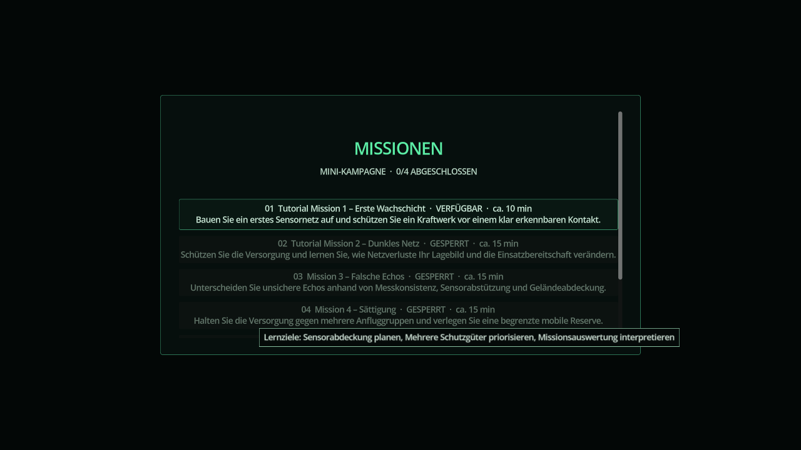

# Mission 4 – Sättigung

Das Finale wird nach Falsche Echos freigeschaltet. Es kombiniert 14 Kontakte aus zwei bekannten abstrakten Klassen in drei angekündigten Angriffsphasen. Die Simulation dauert sieben Minuten. Das Kommandozentrum und mindestens ein weiteres Schutzgut müssen erhalten bleiben.

Die mobile Reserve besitzt 12 Schuss, 240 Einheiten Reichweite und die bekannten Abbau-, Fahrt- und Aufbauphasen. Eine Verlegung kostet 35 Budget. Phase 1 bedroht West und Zentrum, Phase 2 den Osten; die Abschlussgruppe mischt beide Achsen.

## Schwierigkeitsvarianten

Standard beginnt mit 4000 Budget, Herausforderung mit 3400. Beide verwenden denselben Seed und dieselben Kontakte: Unterschiede entstehen durch die verfügbaren Aufstellungen. Die Herausforderung ist in der Missionsübersicht separat anwählbar, benötigt dieselbe Freischaltung und zählt zum selben Kampagnenabschluss. Save/Load behält die gewählte Ressource und das Budget.

## Geprüfte Strategien

1. Frühwarnsensoren (400, 500), (1400, 450); Kurzstreckenabwehr (650, 470); Mittelstreckenabwehr (1320, 520); mobile Reserve (1100, 700). Die Reserve wird T+140 nach (1600, 650) verlegt. Diese Strategie besteht beide Varianten.
2. Frühwarnsensor (900, 400); Kurzstreckensensoren (380, 500), (1400, 600); Kurzstreckenabwehr (650, 470), (1100, 700); Mittelstreckenabwehr (1500, 600). Diese verteilte Strategie besteht Standard mit höheren Verlusten und höherem Munitionsverbrauch.

Die Auswertung nennt Munitionsverbrauch, abgeschlossene Verlegungen und Netzausfälle. Externes Schwierigkeits-, Fairness- und Zeitbalancing bleibt Teil von #20.

Die vollständige Missionsübersicht wurde bei 1280×720 gerendert: vier Kampagnenmissionen, Herausforderung und freies Szenario bleiben über die Scrollfläche erreichbar.

