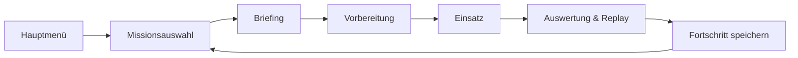
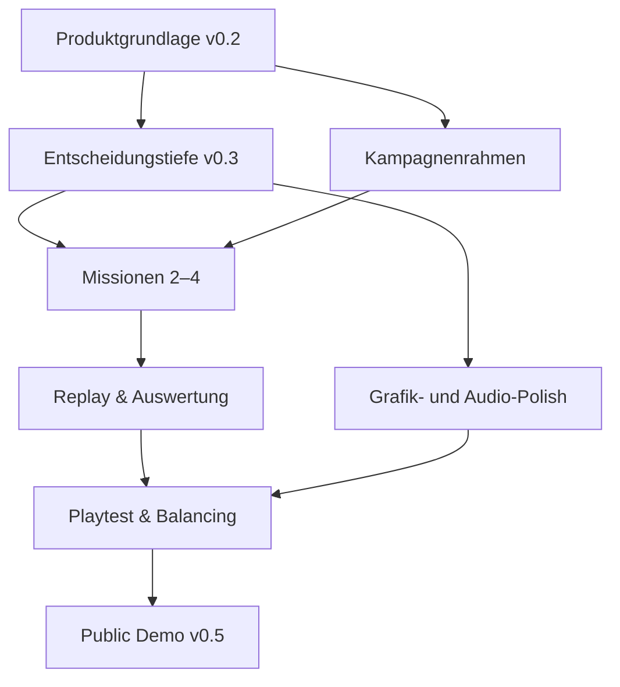

# Radar Operator – Produktvision v0.5 Public Demo

## 1. Zielbild

Radar Operator v0.5 ist eine kostenlose öffentliche Desktop-Demo mit einer handgefertigten Mini-Kampagne aus vier aufeinander aufbauenden Missionen und ungefähr 60 bis 90 Minuten Spielzeit.

Der Spieler erlebt die Arbeit in einem fiktiven Luftlage-Kontrollraum als verständliches, spannendes Informationsspiel. Erfolg entsteht nicht durch schnelle Reflexe oder das direkte Steuern einzelner Waffen, sondern durch Sensorplanung, das Bewerten unsicherer Tracks, geeignete Einsatzregeln und wenige bewusste manuelle Entscheidungen.

> Aus unvollständigen Signalen entsteht ein belastbares Lagebild – und aus einem guten Lagebild eine nachvollziehbare Entscheidung.

Die Demo soll genug Tiefe besitzen, damit Spieler ihre Planung nach einer Niederlage sichtbar verbessern können, ohne reale Systeme oder Einsatzverfahren detailgetreu abzubilden.

## 2. Zielgruppe und Nutzungssituation

### Primäre Zielgruppe

- Spieler taktischer Strategie- und Managementspiele
- Spieler, die Systeme beobachten, Regeln optimieren und aus Auswertungen lernen
- Interessierte an Leitstandatmosphäre und informationsbasierten Entscheidungen
- Desktop-Spieler mit Maus und Tastatur

### Erwartetes Erlebnis

- Einstieg ohne externes Handbuch
- kurze, konzentrierte Missionen von 15 bis 25 Minuten
- jederzeit pausierbare Simulation
- verständliche Ursache-Wirkungs-Ketten
- mehrere tragfähige Aufstellungen statt einer einzigen Lösung
- Motivation, Missionen mit besseren Regeln oder Positionen erneut zu spielen

## 3. Produktversprechen

### 3.1 Information bleibt die Kernressource

Reichweite allein erzeugt noch kein gutes Lagebild. Sensorüberlappung, Aktualität, Gelände, Störung und Netzwerkzustand bestimmen, wie zuverlässig ein Track ist.

### 3.2 Regeln führen, der Spieler entscheidet

Abwehrsysteme arbeiten nach konfigurierbaren Regeln. Der Spieler setzt Schutzprioritäten, markiert kritische Tracks und kann eine manuelle Einsatzfreigabe erteilen oder entziehen. Direktes manuelles Zielen bleibt außerhalb der Produktvision.

### 3.3 Jede wichtige Reaktion ist erklärbar

Trackdetails, Abwehrentscheidungen und die Missionsauswertung zeigen, welche Informationen vorlagen, welche Regel griff und weshalb ein System handelte oder untätig blieb.

### 3.4 Der Kontrollraum ist eine hochwertige 2D-Oberfläche

Die Produktversion bleibt ein fokussiertes 2D-Spiel. Tiefe entsteht durch Typografie, Animation, Kartenebenen, Audio, klare Zustände und eine kohärente retro-technische Leitstandästhetik – nicht durch einen begehbaren 3D-Raum.

### 3.5 Fiktiv und abstrahiert

Staaten, Systeme, Signaturen, Reichweiten und Wirkungsmodelle bleiben fiktiv. Das Spiel priorisiert Lesbarkeit, Fairness und strategische Entscheidungen vor technischer Realitätsnähe.

## 4. Release-Umfang

### Enthalten

- Hauptmenü, Missionsauswahl, Einstellungen und Kampagnenfortschritt
- vier handgefertigte, aufeinander aufbauende Missionen
- Sensor-, Track-, Abwehr-, Infrastruktur-, Energie- und Kommunikationsspiel
- manuelle Trackpriorität und Einsatzfreigabe
- konfigurierbare Einsatzregeln mit Entscheidungserklärungen
- Gelände- und Sichtbarkeitseinfluss
- mobile Systeme und Verlegung während geeigneter Missionsphasen
- elektronische Störung und Täuschkontakte in abstrahierter Form
- animierte Auswertungs- und Replay-Zeitleiste
- persistente Einstellungen und versionssichere Spielstände
- hochwertige 2D-Grafik, UI-Audio und priorisierte Sprach- oder Textmeldungen
- barrierearme Bedienung sowie anpassbare Eingaben
- automatisierte Builds für Windows, Linux und macOS
- Veröffentlichung über GitHub Releases und itch.io

### Nicht enthalten

- begehbarer 3D-Kontrollraum
- Multiplayer
- prozedurale nationale Meta-Kampagne
- vollständiger Szenario-Editor
- Steam-Veröffentlichung oder kostenpflichtiger Vertrieb
- realistische physikalische Radar- oder Flugkörpersimulation
- reale Staaten, Organisationen oder konkrete Waffensysteme

## 5. Mini-Kampagne

| Mission | Lern- und Spannungsziel | Neue Systeme |
| --- | --- | --- |
| 1 – Erste Wachschicht | Kernablauf verstehen | Sensor, Track, automatische Abwehr |
| 2 – Dunkles Netz | bewusste Regeln und Ausfälle beherrschen | Energie, Kommunikation, manuelle Freigabe |
| 3 – Falsche Echos | Information kritisch bewerten | Gelände, Störung, Täuschkontakte |
| 4 – Sättigung | alle Systeme unter Zeit- und Ressourcendruck kombinieren | mobile Systeme, mehrere Angriffsachsen, Kampagnenfinale |

Missionen werden nach erfolgreichem Abschluss freigeschaltet. Eine Niederlage blockiert Wiederholungen nicht. Die Auswertung bietet konkrete Hinweise, ohne eine optimale Lösung vorzugeben.

## 6. Spielerfluss

Jede Mission folgt derselben verständlichen Grundstruktur. Neue Mechaniken werden zunächst isoliert eingeführt und später kombiniert.

## 7. Präsentationsvision

### Visuelle Richtung

- dunkle Leitstandflächen mit klaren grünen, gelben und roten Informationsstufen
- präzise technische Typografie und konsistente Symbolfamilie
- Karteninformationen unterscheiden sich durch Form, Linie, Text und Farbe
- Animationen erklären Zustandswechsel und Informationsalter
- Panels skalieren sauber von 1280×720 bis 2560×1440
- Effekte bleiben deaktivierbar und überdecken keine taktischen Informationen

### Audio

- zurückhaltendes Kontrollraumambiente
- priorisierte Warn- und Bestätigungssignale
- kurze sachliche Meldungen für kritische Zustandswechsel
- getrennte Lautstärke für Gesamtmix, Warnungen und Meldungen
- keine dauerhafte Alarmkulisse ohne Informationswert

## 8. Qualitätsziele

### Spielbarkeit

- ein neuer Spieler beendet Mission 1 ohne externe Erklärung
- jede neue Mechanik wird vor ihrer Kombination praktisch eingeführt
- alle Niederlagen enthalten mindestens eine nachvollziehbare Ursachenbeschreibung
- jede Mission besitzt mindestens zwei im Test nachweislich tragfähige Strategien

### Technik

- deterministische Simulation bleibt für identische Seeds und Befehle reproduzierbar
- 60 FPS bei 1920×1080 auf definierter Referenzhardware
- Stressszenario mit mindestens 200 Kontakten ohne Scriptfehler
- Laden und Speichern über Inhaltsversionen hinweg mit klarer Fehlermeldung oder Migration
- keine blockierenden Fehler oder bekannten Datenverlustrisiken zum Demo-Release
- reproduzierbare Debug-Builds für alle drei Desktop-Zielplattformen

### Barrierefreiheit

- vollständiger Kernablauf per Maus und Tastatur
- frei belegbare zentrale Eingaben
- keine spielentscheidende Information ausschließlich über Farbe oder Audio
- hoher Kontrast, reduzierte Effekte und getrennte Audiooptionen
- Pause ohne spielerische Strafe

## 9. Erfolgskriterien der öffentlichen Demo

- mindestens 80 % der beobachteten Testspieler schließen Mission 1 ohne Hilfestellung ab
- mindestens 70 % verstehen nach Mission 2 den Unterschied zwischen Trackpriorität und Einsatzfreigabe
- mindestens 60 % starten nach einer Niederlage freiwillig einen zweiten Versuch
- keine Abstürze oder beschädigten Spielstände in der Release-Testmatrix
- alle automatisierten Tests sowie native Starttests auf Windows, Linux und macOS bestehen
- häufigste Abbruch- und Verständnisprobleme sind aus externen Playtests dokumentiert

Die Prozentwerte sind Zielgrößen für Playtests, keine bereits gemessenen Produktkennzahlen.

## 10. Technische Leitplanken

- Godot 4.7.2 als geprüfte Basis; Upgrades erfolgen nur mit vollständiger Regression
- GDScript und textbasierte Godot Resources bleiben Standard
- Simulation, Präsentation und Persistenz bleiben getrennt
- Szenarien werden gegen ein versioniertes Schema validiert
- Spieleraktionen, wichtige Systementscheidungen und Ereignisse bleiben protokollierbar
- neue Mechaniken erhalten deterministische Unit- oder Szenariotests
- externe Inhalte und Assets benötigen dokumentierte, GPL-kompatible Lizenzen

## 11. Meilensteine

### v0.2 – Produktgrundlage

Hauptmenü, Missionskatalog, Fortschritt, Einstellungen, Designsystem und ein versioniertes Inhaltsmodell schaffen den stabilen Rahmen für mehrere Missionen.

### v0.3 – Entscheidungstiefe

Manuelle Priorisierung, Einsatzfreigabe, erklärbare Regeln, Energie- und Kommunikationsnetz, Gelände, mobile Systeme sowie Störung erweitern das Kernspiel.

### v0.4 – Mini-Kampagne

Vier Missionen bilden eine vollständige Lern- und Spannungskurve. Replay und Auswertung erklären Entscheidungen über die gesamte Kampagne.

### v0.5 – Public Demo

Grafik, Audio, Barrierefreiheit, Performance, Balancing, Save-Kompatibilität und Release-Automation erreichen öffentliche Demoqualität.

## 12. Abhängigkeitsübersicht

## 13. Priorisierter Backlog

| ID | Arbeitspaket | Meilenstein | Priorität |
| --- | --- | --- | --- |
| V05-01 | Hauptmenü und Missionsauswahl | v0.2 | P0 |
| V05-02 | Kampagnenprofil und Fortschritt | v0.2 | P0 |
| V05-03 | Einstellungen, Eingaben und Barrierefreiheit persistieren | v0.2 | P0 |
| V05-04 | Responsives 2D-UI-Designsystem | v0.2 | P1 |
| V05-05 | Versioniertes Szenario- und Inhaltsmodell | v0.2 | P0 |
| V05-06 | Manuelle Trackpriorität und Einsatzfreigabe | v0.3 | P0 |
| V05-07 | Einsatzregel-Editor mit Entscheidungserklärungen | v0.3 | P0 |
| V05-08 | Energie- und Kommunikationsnetz als Spielsystem | v0.3 | P0 |
| V05-09 | Gelände, Höhe und Sichtbarkeitsmasken | v0.3 | P1 |
| V05-10 | Mobile Systeme und Verlegung | v0.3 | P1 |
| V05-11 | Störung und Täuschkontakte | v0.3 | P1 |
| V05-12 | Kampagnenfluss und Briefingrahmen | v0.4 | P0 |
| V05-13 | Tutorial Mission 2 – Dunkles Netz | v0.4 | P0 |
| V05-14 | Mission 3 – Falsche Echos | v0.4 | P0 |
| V05-15 | Mission 4 – Sättigung | v0.4 | P0 |
| V05-16 | Animierte Replay- und Auswertungszeitleiste | v0.4 | P1 |
| V05-17 | Grafik-, Animation- und Audio-Produktionspass | v0.5 | P1 |
| V05-18 | Save-Migration und Inhaltskompatibilität | v0.5 | P0 |
| V05-19 | Performance-, Barrierefreiheits- und Plattform-QA | v0.5 | P0 |
| V05-20 | Externer Playtest und Balancing | v0.5 | P0 |
| V05-21 | Release-Automation und Veröffentlichung | v0.5 | P0 |

Diese IDs bleiben als stabile Planungsreferenz in Issue-Titeln und Dokumentation erhalten. GitHub-Issue-Nummern werden zusätzlich vergeben.

## 14. Lizenz- und Veröffentlichungsmodell

Der Quellcode wird unter **GNU General Public License v3.0 or later** (`GPL-3.0-or-later`) veröffentlicht. Abgeleitete und verteilte Programmversionen müssen die Bedingungen der GPL erfüllen und den entsprechenden Quellcode zugänglich machen.

Assets dürfen nur aufgenommen werden, wenn ihre Lizenz dokumentiert und mit der GPL-Veröffentlichung vereinbar ist. Für spätere proprietäre Plattform-SDKs oder Store-Integrationen ist vor der Einbindung eine gesonderte Lizenzprüfung notwendig.
